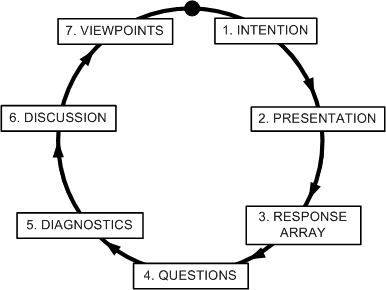

In his article [“How To Ask Questions The Smart Way,”](http://www.catb.org/esr/faqs/smart-questions.html) Eric S. Raymond introduces the audience with communication skills that will help the person how to ask and answer the question. Back in high school, teachers often use the phrase “don’t be shy, there is no such thing as a stupid question.” Unfortunately, Raymond thinks differently. Many people ask questions without contemplating and spending time on their own. He suggests these people to take a number of steps to analyze and think before asking a question on the online platform, such as Stack Overflow.

## Just Give Me The Answer!
Inquiring in a hasty way will bring down one’s credibility in the open-source community. Many people tend to take advantage of the free platform and post numerous questions that just tend to demand answers. I have found one such question from the post on Stack Overflow: [“What is missing in this coding?”](https://stackoverflow.com/questions/65567876/what-is-missing-in-this-coding) The user provides the community the lines of code and simply puts an error message at the end. Then the person states, “it is not displaying the expected outcome” which violates the principles established by Raymond as the user does not explain what the problem is and does not show much effort in solving the problem.

## Spend Time Before You Post
The quality of the answers will reflect how much effort the user decides to put in when forming the question. It certainly takes time to answer questions that are asked intelligently, and the following post demonstrates such qualities: [“How do I find all files containing specific text on Linux?”](https://stackoverflow.com/questions/16956810/how-do-i-find-all-files-containing-specific-text-on-linux) He first starts off his post by describing the goal of his program “I’m trying to find a way to scan …” and also clarifies his question by stating “I’m looking for text within the file, not in the file name.” By comprehensively reviewing the question with the reader, the online community members quickly understand the entire picture and assist accordingly. Then, he proceeds to add that he came across the solution which he already has tried and did not work, which shows the efforts that he put in his work. By interacting with the audience in the right way, he was able to receive many valuable answers from the community along with votes. 

## To Get Better Answers, Ask Better Questions
Postgraduates enter the labor market with multiple unique accomplishments and great resumes, but in the end interpersonal skills and interactions between people are crucial and necessary. I firmly believe what makes a difference on the discussion table is not simply a “4.0,” but being able to communicate effectively to deliver a message across to the others. We live in a world where collaboration plays a vital role in the success of individuals, and therefore it is important to learn how to ask effective questions to receive the help you need from the community.
