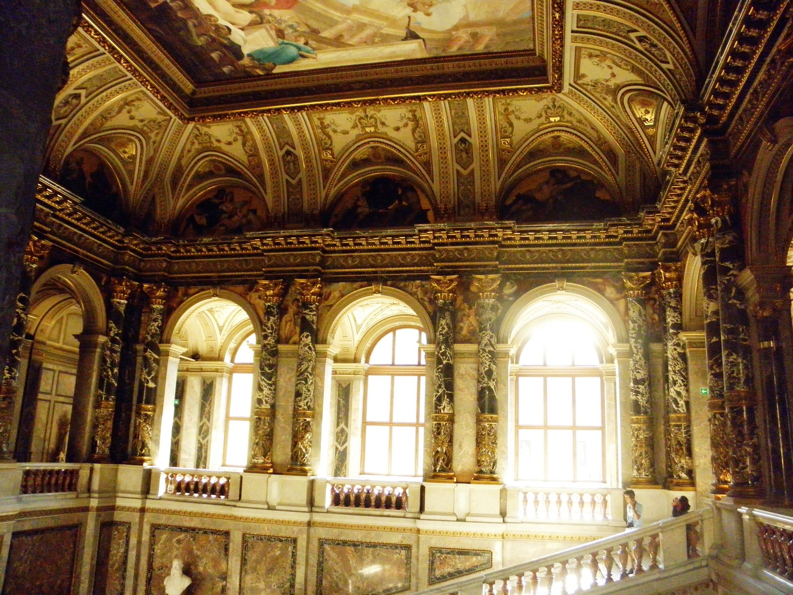

## Renaissance Values
I recall learning about different styles of painting, sculpture, and decorative arts of the period of European history known as the Renaissance in high school. Many renowned artists and creative individuals emerged and are still mentioned in the field of art many times. This era has been particularly highlighted and referred to because many of the paintings and pieces we know are for this period. When I think about the standard of coding, it often reminds me of the values between personality and objectivity, and the comparisons between Renaissance and coding. Although being iconic and unique are denoted and respected and valued, in the world of coding I am convinced that there should be coding standards.

## Coding Standards Enhance Your Documentation
Why? We value the arts from Renaissance because they bring us to jump into a deep investigation across unparallel compositions. They are awe-inspiring, classical arts which each masterpiece tells a different story. However, I believe that coding is different from art. Although coding can entail a touch of personal direction and taste, it is more of a factual, objective delivery for the audience to scrutinize and unwind if necessary. If all of the coders had a standard set of definitions like a dictionary for all English words, it would be very convenient and efficient for all coders across the world to communicate and to share their thoughts in coding languages. If there are clear coding standards, it would be very helpful to learn a programming language, possibly as easy as learning a foreign language. 

## Get Those Green Checkmarks
The checkmarks in the platform are certainly helpful to both check and educate me as I move forward with different commands and words. Although sometimes it is challenging to get those green checkmarks to complete the entire picture, I believe they are invaluable, necessary steps to become a proficient coder in the future. Having a sense of directions and standard answers definitely helps me to stay on track, to reflect back on the definitions and equations of the coding language, and to further refine my elementary coding style and syntax.
