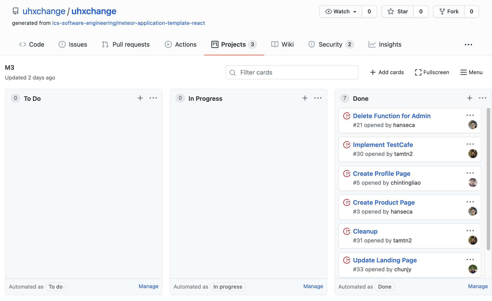

## Create a to do list 
I started using a to-do list coming into college. It helps me to remember upcoming tasks and to manage my time efficiently as I can ahead. A style of [Agile Project Management](https://www.apm.org.uk/resources/find-a-resource/agile-project-management/#:~:text=Agile%20project%20management%20is%20an,project%20throughout%20its%20life%20cycle.&text=Iterative%20approaches%20are%20frequently%20used,than%20following%20a%20linear%20path) called Issue Driven Project Management is the best to-do list template for group projects. Since each group member has a different schedule, they cannot always work together to produce the entire project. However, the management method allowed us to work independently and check up on other’s work as well. First, we created a project board by dividing up the work into tasks and assigning them to each person in the group. Second, we worked separately and met twice a week to resolve any issues. It was my first time working on the entire group project online, but it went much smoother than I expected.

## Making Bibimbap
Issue Driven Project Management is like making Bibimbap. My group used a [meteor-example-form-react template](https://github.com/ics-software-engineering/meteor-example-form-react) as the base of our project, cooked each ingredient to be placed on the rice independently, and finally mixed all the ingredients to produce [UHXchange](https://uhxchange.github.io/) web application. I am excited to use the management skill I have acquired from this project in many settings. If I were to revisit my internship at First Hawaiian Bank, I would use this management skill as many of the departments in the business industry work separately but together for a project. I believe issue-driven project management can certainly be a useful skill set to organize responsibilities distributed to each department for many projects.

## Get Those Green Checkmarks
Clear coding standards can give insight into programming languages. If all of the coders had a standard set of definitions like a dictionary for all English words, it would be very convenient and efficient for all coders across the world to communicate and to share their thoughts in coding languages. The green checkmarks in the platform are certainly helpful to both check and educate me as I move forward with different commands and words. Although sometimes it is challenging to get those checkmarks to complete the entire picture, I believe they are invaluable, necessary steps to become a proficient coder in the future. Having a sense of directions and standard answers definitely helps me to stay on track, to reflect back on the definitions and equations of the coding language, and to further refine my elementary coding style and syntax.
