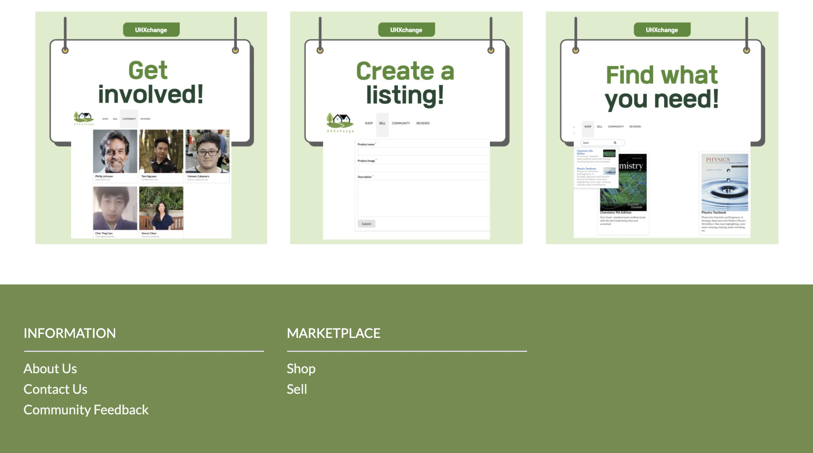
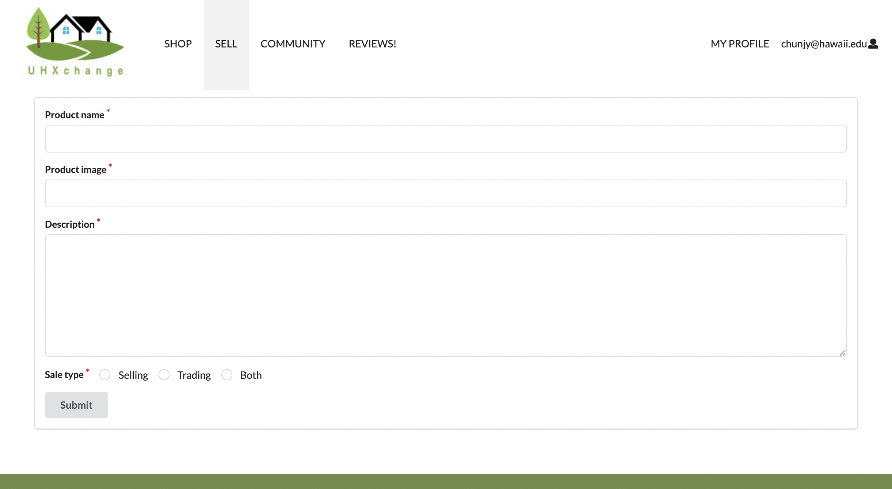
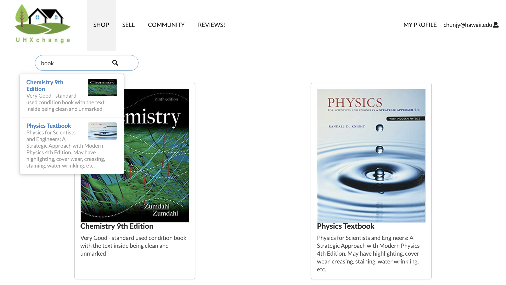

The University of Hawaii at Manoa is a diverse university as many students come from outside of the island to further their education. According to the [University of Hawaii at Manoa website](https://manoa.hawaii.edu/about/), twenty-nine percent of the student population is from out-of-state, and seven percent is from international. Therefore, many students move in and out of the dorm and need a marketplace where they can sell or buy dorm-related goods. To address the students’ needs, [UHXchange](https://uhxchange.github.io/) is designed to facilitate buying and selling of items where students can create a listing or contact sellers to purchase items at an affordable price. Students can also sell other campus-related items such as used textbooks, which engages the community to recycle and reuse items effectively.

The [meteor-example-form-react template](https://github.com/ics-software-engineering/meteor-example-form-react) was used as the fundamental foundation for this project. I worked on the landing page to guide users through the website, the “Sell” page to create a listing, and the search feature to find a specific item. I tried to limit the colors to only white and green to keep the presentation clean and organized. The color green creates the image of a green cycle, which suits the main objective of our website. The simple schema from [uniforms](https://uniforms.tools/) was used to create the “Sell” page and allows the user to put an image and description of the item. The search module from [Semantic UI React](https://react.semantic-ui.com/modules/search/#types-standard) was used to develop the search bar on the “Buy” page. When the user puts a word in the search bar, it will search through the product name and description and list all the items that match. Then the user can click on each item to view the seller information.

Communication and time management skills were significant to accomplish each milestone. Overall, my group had effective communication as we addressed parts that needed to be modified and replied to any questions in the discord chat channel. I appreciate my group for putting their efforts into finishing this project. The GitHub project board was very useful in identifying each group member's responsibilities and their progress. Learning the Issue Driven Project Management was the major takeaway from this class as it helps to identify potential issues and develop solutions throughout the group project. Such management skills helped our group to be on the same page even when we are working separately.
